# TFG-Juego-Educativo
Proyecto desarrollado en el segundo semestre de cuarto año de Ingeniería Informática. Este proyecto será un videojuego educativo, desarrollado con React para todas las plataformas (móvil, tablet, ordenador)

## Estructura de carpetas del proyecto:

```
.
├── 📁 client
│   └── 📁 public
│       └── 🗎 index.html
|   └── 📁 src
|       └── 📁 components
|           ├── 🗎 Footer.js
|           ├── 🗎 Header.js
|           └── 🗎 Layout.js
|       └── 📁 image
|           ├── 🗎 04B_30__.TTF
|           ├── 🗎 background.jpg
|           ├── 🗎 gear.png
|           ├── 🗎 rainyhearts.ttf
|           └── 🗎 upheavtt.ttf
|       └── 📁 other
|           ├── 🗎 encrypt.js
|           └── 🗎 generateKey.js
|       └── 📁 pages
|           ├── 🗎 App.js
|           ├── 🗎 Edit.js
|           ├── 🗎 Game.js
|           ├── 🗎 Home.js
|           ├── 🗎 Loby.js
|           ├── 🗎 SignIn.js
|           └── 🗎 SignUp.js
|       └── 📁 styles
|           └── 📁 app
|               ├── 🗎 edit.css
|               ├── 🗎 game.css
|               └── 🗎 loby.css
|           └── 📁 layout
|               ├── 🗎 footer.css
|               ├── 🗎 header.css
|               └── 🗎 layout.css
|           ├── 🗎 index.css
|           └── 🗎 log.css
|       └── 🗎 index.js
│   ├── 🗎 Dockerfile
│   ├── 🗎 package-lock.json
|   └── 🗎 package.json
├── 📁 readme-image
|   ├── 🗎 images for README.md
|   └── 🗎 ...
├── 📁 server
|   └── 📁 src
|       └── 📁 db
|           └── 📁 export
|               └── 🗎 database.sql
|       └── 📁 module
|           ├── 🗎 connection.js
|           ├── 🗎 game.js
|           ├── 🗎 router.js
|           └── 🗎 verification.js
|       └── 🗎 index.js
│   ├── 🗎 .dockerignore
│   ├── 🗎 .env
│   ├── 🗎 Dockerfile
│   ├── 🗎 package-lock.json
|   └── 🗎 package.json
├── 🗎 .gitignore
├── 🗎 docker-compose.yml
└── 🗎 README.md
```

## Ejecutar Proyecto Localmente: ##

- Docker:

    - Levantar docker:

        ```
        docker-compose up -d
        ```

    - Salir contenedor docker:

        ```
        docker-compose down
        ```

    - Eliminar contenedor docker:

        ```
        docker-compose down --rmi all
        ```

    - Ver contenedores docker:

        ```
        docker ps
        ```

    - Ejecutar contenedor docker en terminal integrada:

        ```
        docker exec -it <nombre-contenedor> bash
        ```

        ```
        docker exec -it tfg-juego-educativo-db-1 bash
        ```

- MySQL:

    - Comprobar:

        ```
        mysql -u <usuario-base-de-datos> -p <nombre-base-de-datos>
        ```

        ```
        mysql -u root -p tfg_database
        ```

        - Te pedira la contraseña para verificar tu identidaz

- Servidor:

    - Abrir la carpeta

        ```
        cd server
        ```

    - Instalar dependencias

        ```
        npm i
        ```

    - Ejecutar el servidor

        ```
        npm start
        ```

- Aplicación:

    - Abrir la carpeta del proyecto

        ```
        cd client
        ```
    
    - Instalar dependencias

        ```
        npm i
        ```

    - Iniciar aplicación

        ```
        npm start
        ```

## Despliegue en AWS Lightsail: Servidor y DB ##

- Amazon Lightsail(creación de una máquina virtual con Debian):

    Lo primero que hay que hacer es crear una máquina con Debian, y configurar una IP estatica para que cada vez que se reinicie el servidor no cambie la IP.

    Los pasos a seguir posteriormente es configurar la terminal del servidor:

    - Actualizar la lista de paquetes del Sistema Operativo:

    ```
    sudo apt-get update
    ```

    - Actualizar los paquetes:
    
    ```
    sudo apt-get upgrade
    ```

    - Instalar Node js en nuestra versión(v18.12.1):

    ```
    curl -sL https://deb.nodesource.com/setup_18.x | sudo -E bash -
    ```

    - Despues te pedira instalar el gestor de paquetes npm:

    ```
    sudo apt-get install -y nodejs
    ```

    - Comprobar tanto si ha sido instalado node y npm:

    ```
    node --version
    ```

    ```
    npm --version
    ```

    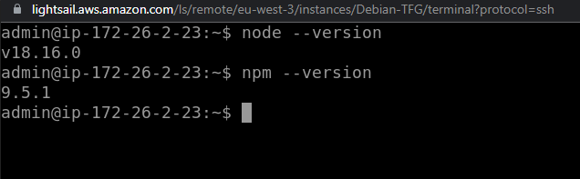

    Node.js en Debian no podemos escuchar aplicaciones por debajo del puerto 1024. Y queremos dar permisos para que se escuche el puerto 80 que corresponde al puerto (http). Instalaremos una herramienta llamada (libcap2):

    ```
    sudo apt-get install libcap2-bin
    ```

    Configurar Node.js para que pueda ejecutar puertos inferiores al 1024.

    ```
    sudo setcap cap_net_bind_service=+ep `readlink -f \`which node\``
    ```
    En la siguiente imagen se puede ver como libcap ya viene instalado en nuestro sistema operativo y que Node.js ya ha sido configurado correctamente para escuchar puertos por debajo del 1024.

    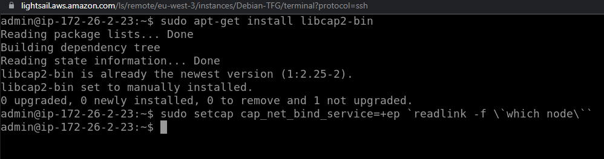

    A continuación, no ejecutaremos la aplicación normal como solemos hacer con Node.js "npm start", "node index.js", etc. Instalaremos un módulo de Node.js llamado pm2. Pm2 es un gestor de procesos para producción, nos permite ejecutar nuestra aplicación como si estuvieramos en local pero nos garantiza que si nuestro servidor se cae o se reinicia, o ocurra algún error que nos haga que nuestra aplicación se caiga, nos levante automaticamente nuestro servidor. Añadiremos -g al final para especificar que se instale de manera Global.

    ```
    sudo npm install pm2 -g
    ```

    Podemos poner el siguiente comando para ver los procesos que esten en ejecución. Por ahora no hay ningún proceso activo:

    ```
    pm2 ls
    ```

    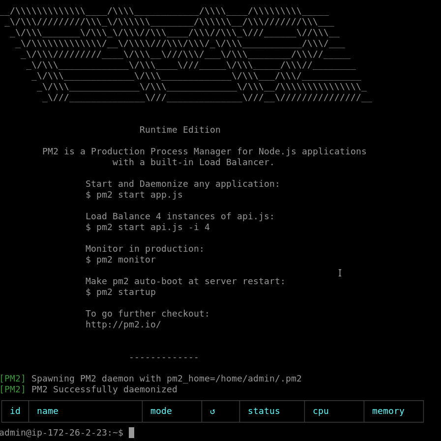

    - Comando para que pm2 te de el comando que tienes que ejecutar para que se pm2 se ejute automáticamente en tu sistema.

        ```
        pm2 startup
        ```

        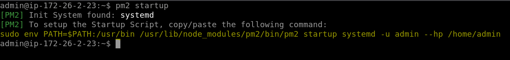

        Ejecutamos el comando que nos proporciona pm2:

        ```
        sudo env PATH=$PATH:/usr/bin /usr/lib/node_modules/pm2/bin/pm2 startup systemd -u admin --hp /home/admin
        ```

        Nos mostrara que pm2 ya ha sido configurado:

        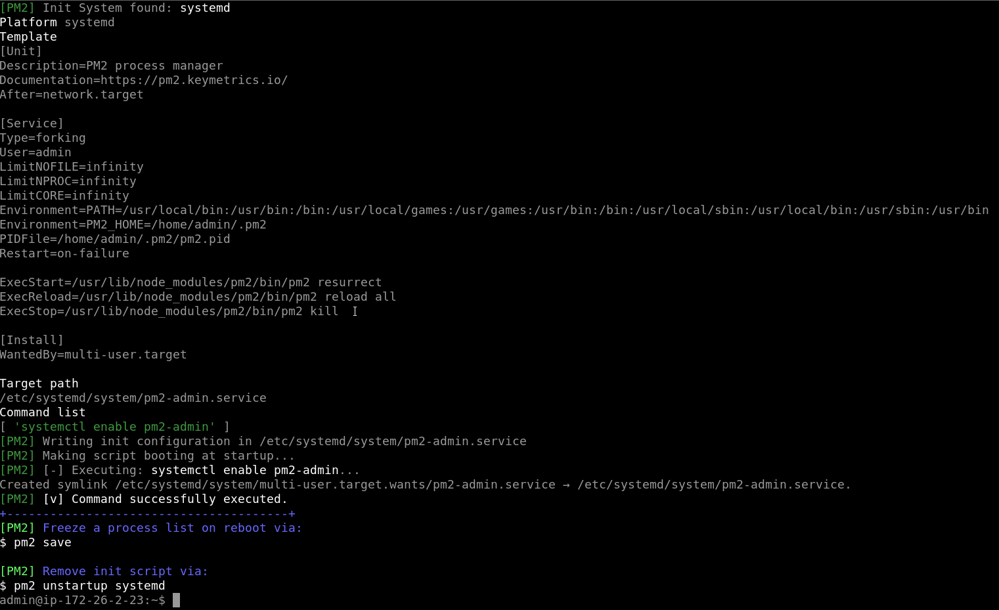

    - Queda instalar git y clonar nuestro repositorio:

        ```
        sudo apt-get install git
        ```
        (Antes de clonar el repositorio instalar Base de Datos MySQL)
        ```
        git clone https://github.com/MarcoGomezGutierrez/TFG-Juego-Educativo.git
        ```

    - Instalar MySQL en Debian (https://computingforgeeks.com/how-to-install-mysql-on-debian-linux-system/):

        Instalar el paquete de instalación que soporta Debian 11 y Debian 10:

        ```
        wget https://dev.mysql.com/get/mysql-apt-config_0.8.18-1_all.deb
        ```

        Instalar el paquete del repositorio que te muestra la consola:
        
        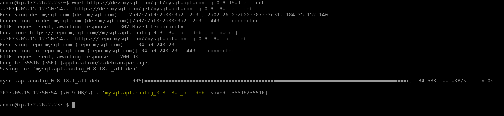

        ```
        sudo dpkg -i mysql-apt-config_0.8.18-1_all.deb
        ```

        Cambiar la version de MySQL, por default aparecera la 8.0 y hay que cambiarlo a la 5.7 que es la que yo estoy usando en mi Base de Datos (Yo ya lo hice antes de hacer las capturas):

        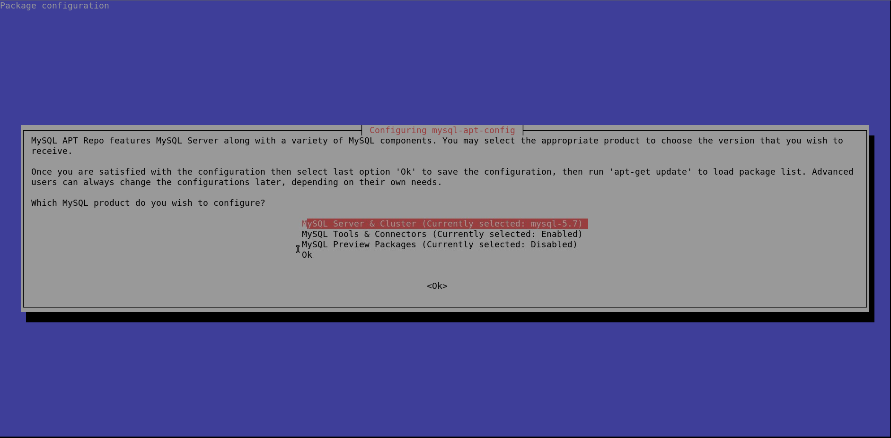

        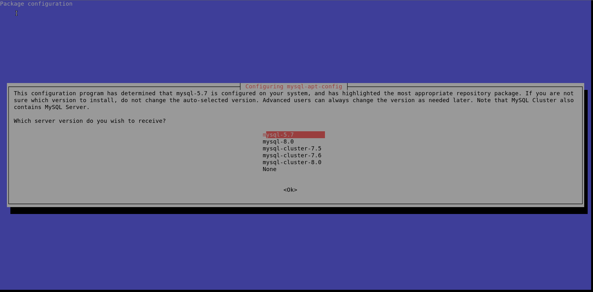
        
        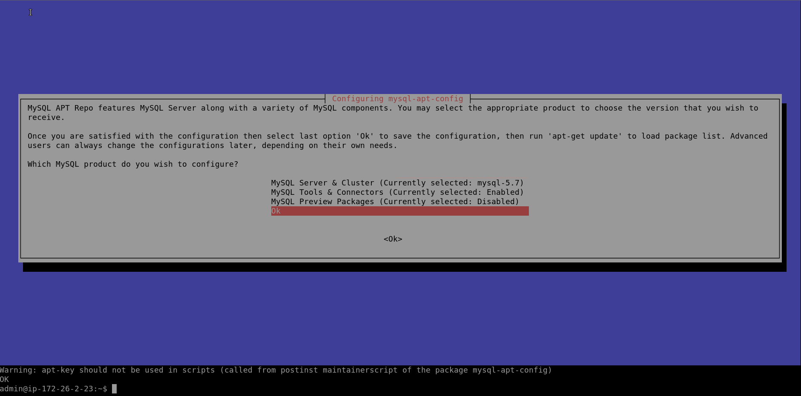

        Una vez instalado hay que actualizar los paquetes del sistema:

        ```
        sudo apt update
        ```
        Nos muestra un error de que la firma no se puede verificar:

        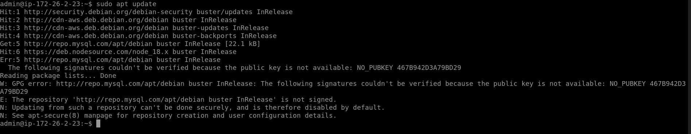

        Error que nos muestra (No copiar):

        ```
        The following signatures couldn't be verified because the public key is not available: NO_PUBKEY 467B942D3A79BD29
        ```

        Importar GPG key(s) que falten donde (467B942D3A79BD29) es la KEY que debemos remplazar por la que nos muestre:

        ```
        sudo apt-key adv --keyserver keyserver.ubuntu.com --recv-keys 467B942D3A79BD29
        ```

        ```
        sudo apt update
        ```

        Y ya estara configurado las claves:

        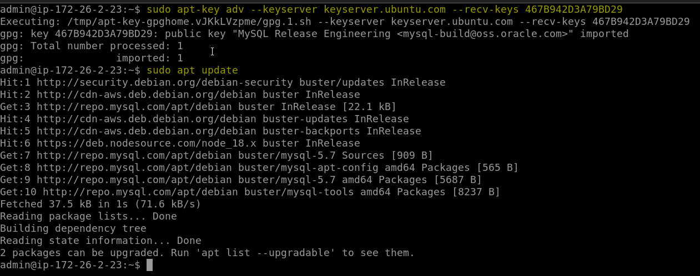

        Instalar MySQL server y te pedira configurar usuario y contraseña de la Base de Datos:

        ```
        sudo apt install -y mysql-community-server
        ```
        Te pedira introducirla dos veces para que se verifique:

        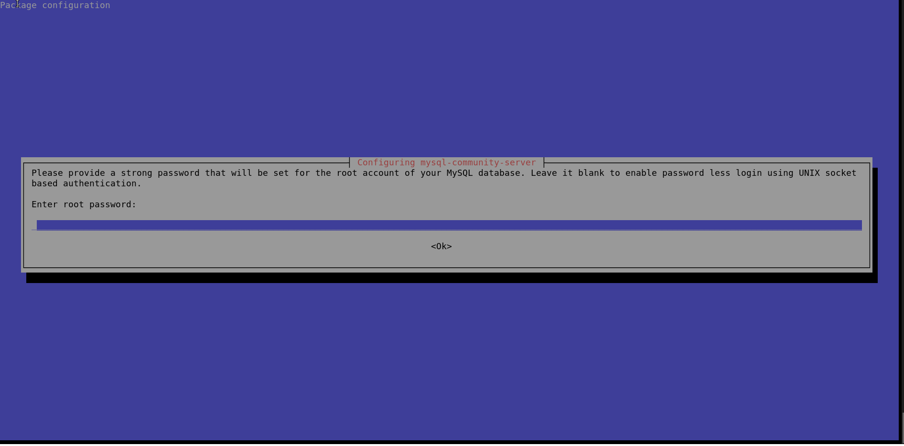

        Cuando está instalado, el servicio MySQL no se inicia de forma predeterminada. Inícielo y también habilítelo para que se inicie automáticamente cada vez que se reinicie el servidor.

        ```
        sudo systemctl restart mysql
        ```

        ```
        sudo systemctl enable mysql
        ```

        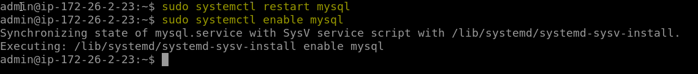

        Hay que verificar si esta activo:

        ```
        systemctl status mysql
        ```

        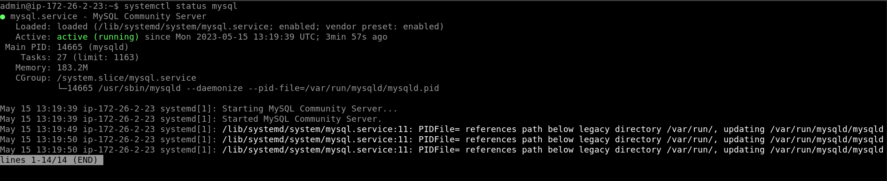

        Asegurar su instalación de base de datos MySQL. Como ya habíamos establecido la contraseña de root, se le pedirá que la ingrese para continuar y también se le preguntará si desea cambiarla.

        ```
        sudo mysql_secure_installation
        ```

        En mi caso he dicho que quiero una seguridad Fuerte (Strong), que elimine todos los usuarios y que solo se permita los usuarios root, también que resetee los privilegios de las tablas.

        

        Ya puedes usar MySQL (siempre te pedira la contraseña):

        ```
        mysql -u root -p
        ```

        ```
        SHOW DATABASES;
        ```
        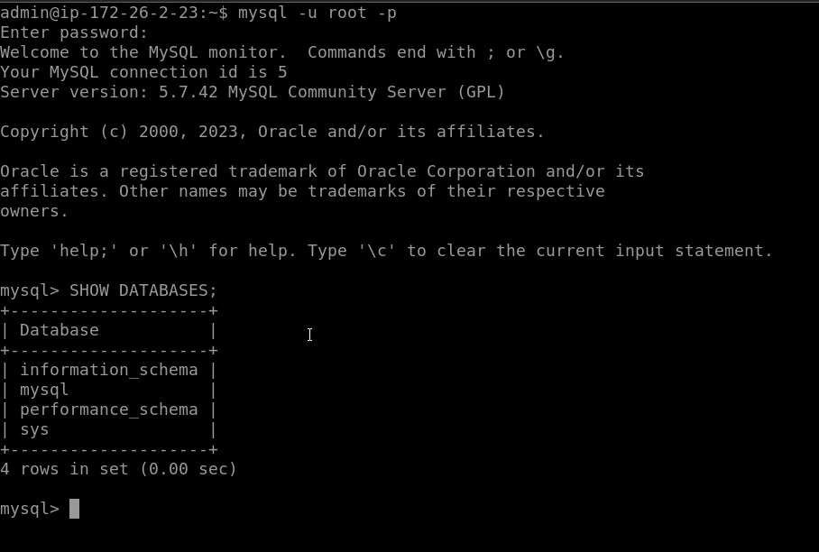

        Ver la version que se haya instalado correctamente:

        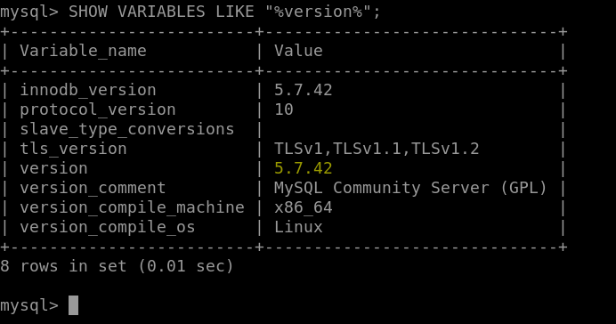

        Para habilitar que MySQL se pueda acceder remotamente:

        - open MySQL port 3306 on the firewall

        ```
        sudo ufw allow mysql
        ```

        - Permitir una dirección especifica para conectarte a MySQL, la IP tiene que ser local.

        ```
        sudo ufw allow from 172.26.2.23 to any port 3306
        ```

    - Crear Base de Datos:

        ```
        CREATE DATABASE tfg_database;
        ```

        ```
        SHOW DATABASES;
        ```

        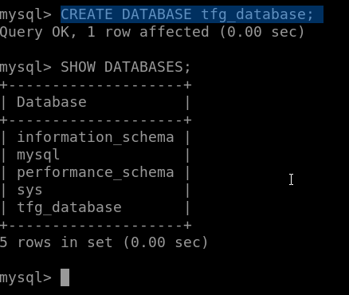

        Exportar en MySQL Workbench un fichero unico para exportar la Base de Datos:

        Ubicado en Server, Data Export. Seleccionar (Export to Self-Contained File) clicar en el Checkbox que dice (Create Dump in Single Transaction) y exportar:

        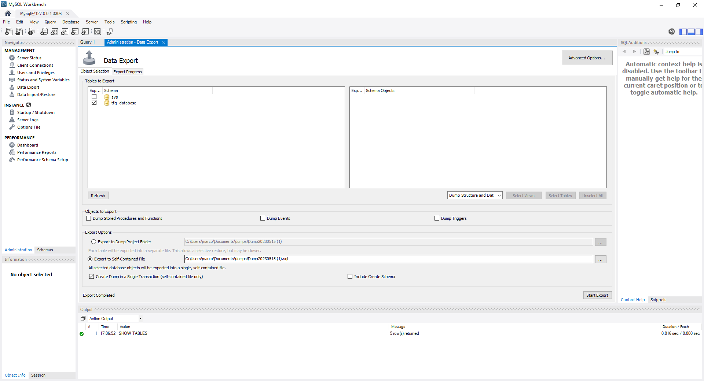

        Ubicarte en la siguiente direccion (admin@ip-172-26-2-23:~/TFG-Juego-Educativo/server/src/db/export) e importar la base de datos con el siguiente comando:

        ```
        mysql -u root -p tfg_database < database.sql
        ```

        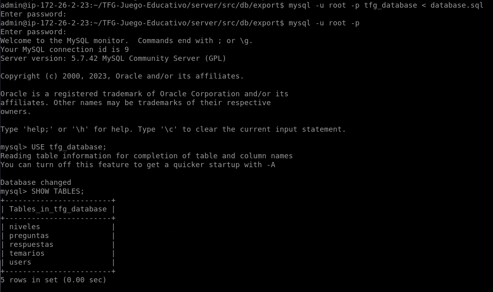

        Configuración de MySQL:

        ```
        sudo nano /etc/mysql/mysql.conf.d/mysqld.cnf
        ```

        Y cambiar por:

        ```
        bind-address = 127.0.0.1
        port = 3306
        ```

        Reiniciar y levantar MySQL de nuevo para que se apliquen los cambios:
        
        ```
        sudo systemctl restart mysql
        sudo netstat -tuln | grep mysql
        ```

    - Clonar el repositorio:

        ```
        git clone https://github.com/MarcoGomezGutierrez/TFG-Juego-Educativo.git
        ```

        Clonamos y editamos el archivo .env(entramos a la ruta):

        Ver directorio:

        ```
        pwd
        ```

        Ver carpetas del directorio:

        ```
        ls
        ```

        Ver carpetas y archivos ocultos:

        ```
        ls -a
        ```

        Para ubicarnos en la carpeta(TFG-Juego-Educativo/server)
        ```
        cd nombre_carpeta
        ```

        Si no esta creado:

        ```
        touch .env
        ```

        Editar el archivo cambiando IPs, Puertos, Contraseñas, Usarios, etc.:

        **- Importante: El archivo .env no puede tener espacios entre "=", saltos de línea, ect. El formato del documento tiene que estar todo junto, sino dejara de funcionar y el servidor no encontrara el archivo .env**
        
        ```
        nano .env
        ```

        (ctrl+x, y, enter) para guardar y salir

        Dentro de la carpeta server instalamos los paquetes de Node.js:

        ```
        npm install
        ```

        Entramos en src y ejecutamos pm2 para correr nuestro proyecto:

        ```
        pm2 start index.js
        ```

        Ver nuestros procesos corriendo:

        ```
        pm2 ls
        ```

        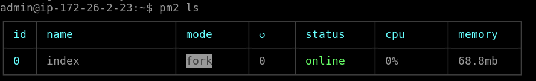

## Gestionar Paquetes de Instalación ##

- Librerias Cliente:

    - Entrelazar diferentes páginas manteniendo los estados de los componentes:

        ```
        npm install react-router-dom
        ```

    - Leer variables de entorno:

        ```
        npm install dotenv
        ```

    - Instalar Sockets para React y conectarse al servidor:

        ```
        npm install socket.io-client
        npm install axios
        ```
    
    - Instalar crypto para utilizar sha256 para sacar el codigo hash de la contraseña:

        ```
        npm install crypto-js
        ```

- Librerias Servidor:

    - Express:

        ```
        npm install express@4
        ```

    - Sockets:

        ```
        npm install socket.io
        ```

    - Manejo de Base de Datos MySQL:

        ```
        npm install mysql
        ```

    - Actualización del servidor sin reiniciar el servidor:

        ```
        npm install --save-dev nodemon
        ```
    
    - Generación del Token:

        ```
        npm install jsonwebtoken
        ```
    
    - Politica de cors para procesar json en una respuesta post:

        ```
        npm install cors
        ```
        
    - Texto json formato Pretty:

        ```
        npm install express-prettify
        ```
    
    - Instalación de modulo para gestionar variables de entorno:

        ```
        npm install dotenv -D
        ```
